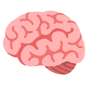

  <h1>Learn</h1>

Compilation of projects built for learning purposes

---

## Rationale

These projects are created for educational purposes, with implementations in various languages and frameworks to facilitate comparison. The version I invested more time in is simply because I find the language or framework more enjoyable to use.

## Featured Projects

### Rust 🦀

- [Caesars](src/caesars) - Encrypt and decrypt your secrets using ROT13 🔐.
  - Backend
  - Frontend
    - [Vue](src/caesars/web/frontend/vue)
    - [Leptos](src/caesars/web/frontend/leptos)
- [Riddles](src/riddles) - Collection of my solution for coding challenges 🥇.
- [Dryip of Rust](https://github.com/azzamsa/dryip-of-rust) - Short Rust 🦀 code snippets for inspiration.

### Javascript 🕸️

- Pokédex
  - [Pokédex Vue](src/pokedex-vue) - Browse your favorite pokemon 🐉.

### Other Projects

Refer to [PROJECTS.md](PROJECTS.md) for the complete list of projects.
