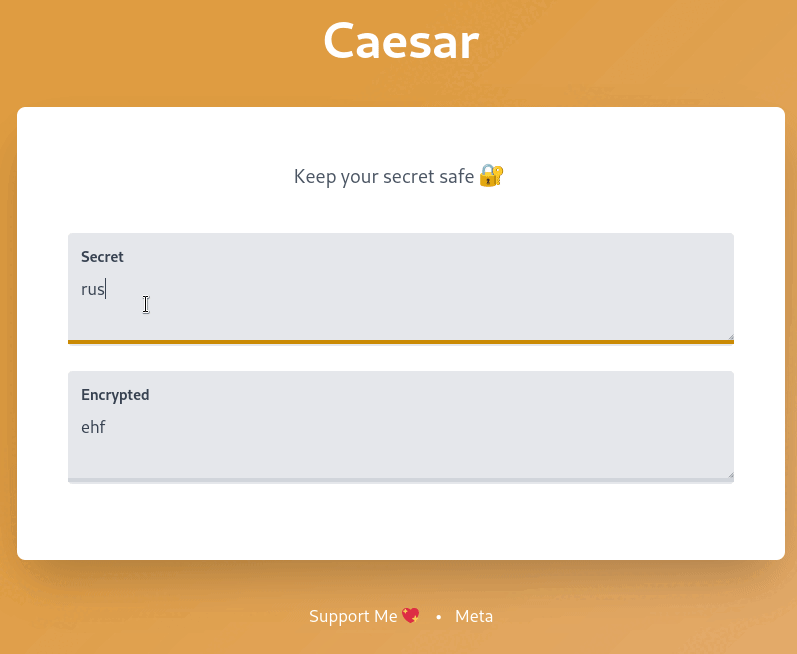

<div align="center">
<h1>Caesars</h1>


Encrypt and decrypt your secrets using ROT algorithm 🔐

<a href="https://github.com/azzamsa/caesars/workflows/ci.yml">
    
</a>

</div>



---

## Rationale

The project started to find a frontend framework that suit my need.
For the [backend](https://github.com/azzamsa/rust-backend-zoo), I found Axum is the most appealing currently.

After some research, now the result is live: [Is Rust Ready for Web Front-End?](https://azzamsa.com/n/rust-frontend/).

## Navigating the Code

All the features can be viewed in the [CHANGELOG](CHANGELOG.md) file tagged with `feat`.
The file only contains user-facing changes, so you won't get lost bisecting the features.

## Frontends

- 🦀 [Dioxus](frontend/dioxus)
- 🖖 [Vue 3](frontend/vue)
- 🎩 [Svelte](frontend/svelte)

## Usage

Start the backend.

```sh
$ cd backend
$ make dev  # see also `make setup`
```

Go to the playground `http://127.0.0.1:8000/playground` to see the schema.

After starting the backend. Choose the frontend framework you want to see.

```sh
$ cd frontend/favorite-frontend
$ make dev
```

## Credits

- [Noto Emoji](https://github.com/googlefonts/noto-emoji)
