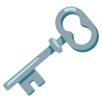

<h1>Keywords</h1>

Collections of language keywords 🗝.

 

---

## 🔥 Features

- 🦀 [Rust](src/rust/src)
- 🐍 [Python](src/python)
- 🍋 [NuShell](src/nushell)
- 🐟 [Fish](src/fish)

## Credits

### Rust

- [richardanaya's Tour of Rust](https://github.com/richardanaya/tour_of_rust)
- [Dhghomon's Easy Rust](https://github.com/Dhghomon/easy_rust)
- [Dumindu Madunuwan's Learning Rust](https://github.com/learning-rust/site)

### Python

- [Jure Šorn's Comprehensive Python Cheatsheet](https://github.com/gto76/python-cheatsheet)
