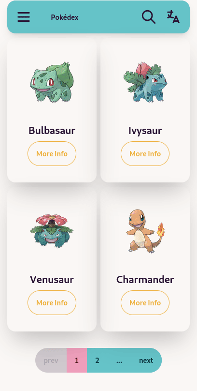

<h1>Pokédex.</h1>

Browse your favorite pokemon 🐉.

 

---

A small project to learn Vue 3.

## 🔥 Features

- Vue 3
  - 🚦 Vue router
  - 🗂 [File based routing](./src/pages)
  - 📦 [Components auto importing](./src/components)
  - 🍍 [State Management via Pinia](https://pinia.vuejs.org/)
  - 📑 [Layout system](./src/layouts)
  - 😃 [Use icons from any iconify sets](https://github.com/antfu/unplugin-icons)
  - 🌍 [I18n ready](./locales)
  - 🔥 Use the [new `<script setup>` syntax](https://github.com/vuejs/rfcs/pull/227)
  - 🤙🏻 [Reactivity Transform](https://vuejs.org/guide/extras/reactivity-transform.html) enabled
  - 📥 [APIs auto importing](https://github.com/antfu/unplugin-auto-import) - use Composition API and others directly
  - ☁️ Deploy on Netlify, zero-config
  - ⚙️ Unit Testing with [Vitest](https://github.com/vitest-dev/vitest), E2E Testing with [Cypress](https://cypress.io/).
- 🎛️ [VueUse](https://github.com/antfu/vueuse) - collection of useful composition APIs
  - [`@vueuse/head`](https://github.com/vueuse/head) - manipulate document head reactively
- 🦾 TypeScript, of course
- 🍃 TailwindCSS + 🌼 daisyUI
  - Sort TailwindCSS class automatically.
- Strict ESLint, Git hooks, Makefile, and more.

## Navigating the Code

All the features can be viewed in the [CHANGELOG](CHANGELOG.md) file tagged with `feat`.
The file only contains user-facing changes, so you won't get lost bisecting the features.

## Credits

- [Pokéapi](https://github.com/PokeAPI/pokeapi) - The Pokémon API
- [Vitesse](https://github.com/antfu/vitesse) - 🏕️ Opinionated Vite + Vue Starter Template
